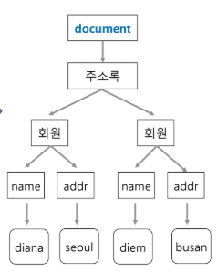

### 과제 gitlab 이름 규칙
> hwjavaxx_seoul_08 예시) hwjava10_seoul_08
### 여담
> 전화번호부 관리는 중요한 homework였다...\
> 1월 4주차 1월 25일에 나왔다.

# Swing에 대한 내용

## Component
> **Button, TextField, List**

 - 내부 구조

    이름|설명
    :--:|:--:
    border|component 자체
    contect|border안에서 글자가 표현되는 부분
    padding|border의 끝와 content 사이
    margin|border와 border 사이

## Containner
> 다른 애들을 포함
```java
 대표 method
 Containner.add(new Component);

 class Containner extends Component
 //Containner.add(new Containner) 가능
```
**Frame, Panel, Window**

**Layout** - contianner에 담기는 규칙  
 - FlowLayout  
 - CardLayout  
 - BorderLayout (기본)

### UI의 기능
 > view : Component와 Containner\
 > event

## Event
> 모든 애들이 유사한 특성을 가졌기 때문데, 이 원리를 알고 있다면 어디서든 그 특성을 알 수 있다.

- **Event Action**  
Click 등
- **Event Source**  
Button 등등
- **Event Listener**    
Click등 Action을 처리 할 method를 가지고 있다.  
Action handler. awt에서는 Event Listener.  
- **Event Callback()**
이 메소드를 오버라이드 해야한다.  
Event를 할 때 실행 될 것.

그래야 click했을 때 button에 이벤트 리스터가 들어서 callback() 메소드가 실행 되서 움직인다!

```java
Button b;

b.addActionListener(new ActionListener() {
    @Override
    public void actionPerformed(ActionEvent e) {
        datas.add(tf.getText());
        l.setListData(datas.toArray());
        tf.setText("");
    }
});
```
코드|설명
:--|:--:
b|Event Source
new ActionListener|Event Listener
actionPerformd()|Event Callback()

* * *
* * *

# XML & Json
**부설**  
> '황하남'이 있으면,   
이게 글자인지 그림인지 부호인지 아는 data  
황하남이 이름인지 동물인지 사물인지 아는 data  

- content를 설명하고 있는 부가적인 설명(data)도 있어야 한다!  
그것이 바로 **meta data**!!  
최초 markup language가 나왔다.  
<이름 성별="남">황하남</이름>  
(얘는 이름이야~ 하는 마크업이 된다.)

구분|SGML|HTML|XML
:-:|:-:|:-:|:-:
복잡도|매우 복잡|간단|보통
확장성|가능|불가능|가능
태그 정의|가능|불가능|가능
스펙|매우 복잡|단순|단순
검색방식|DSSSL|CSS|XSL
S/W|적음, 고가|많음, 저가|많음, 저가

### html과 xml의 차이점
```html
<h1>Web Service</h1>
<h3>강사:AndoroidJava.com</h3>
<ul>
 <li>시간 - 2:00 ~ 6:00
 <li>장소 - MDS</ul>
```
HTML은 브라우저가 내용을 어떻게 보이게 할 것인가에 대해서 태그를 정의한다.

```xml
<강의>Web Service</강의>
<강사>AndoroidJava.com</강사>
<시간>2:00 ~ 6:00</시간>
<장소>MDS</장소>
```
XML은 내용의 의미를 담고있는 태그를 사용자가 정의한다.

### XML의 특징
- Well-formed Document  
5가지 규칙을 잘 지킨 문서

규칙|설명
:-:|:-:
Case Sensitive|대소문자 구분
Closing Tags|태그의 시작과 끝이 모두 있다.<br><태그이름>content</태그이름> <br>content가 없을 때는 <태그이름/>
No Overlapping Tags|포함 관계가 명확해야 한다.<br><강의><시간></시간></강의>
Root Element|하나의 파일에 전체를 감싸는 루트는 하나만!
Attribute|name='value' or name="value"

- Valid Document  
5가지 규칙을 잘 지키면서, 동시에 DTD나 Schema에 정의된 형식에 맞는 문서

```xml
<?xml version="1.0" encoding="euc-kr" standalone="yes"?>
```
 - 1.0 버전의 xml 형식을 따른 문서이다. 라는 뜻

 - 그 외

이름|코드|설명
|:-:|:-|:-:
주석|<!-(-)주석-->|()를 지우고 봐야한다.
처리 지시문|system "~~.exe"|외부 프로그램 사용
CDATA|<!CDATA[2<3]>|'<'는 시작으로 처리 될 수 있으니,<br>이 애들을 처리하기 위해 사용됨.
namespace|<이름 xmlns:파일>|여러 문서가 통합됐을 때 사용한다.<br>마크업의 임름 앞 혹은<br>속성의 이름 앞에 온다.

> namespace 규칙 :
문자나 '\_'로 시작되면서 (문서, 숫자, '.', '-', '\_')로 구성되어 있다.

## DOM(Document Object Model) Parser
- XML은 문서이다.  
이 문서를 객체화 하여 모델을 만들자!

문서에 있는 Root Tag를 Root Node로 두고, 모든 Tag를 Node로 한 Tree형식으로 만든다.

- 노드의 이름과 값

Node|NodeName|NodeValue
:-:|:-:|:-:
Element|태그이름|null
Attr|속성이름|속성값
Text|#text|노드의 내용
CDATASection|#cdata-section|노드의 내용
EntityReference|참조된 엔티티의 이름|null
Entity|선언된 엔티티의 이름|null
ProcessingInstruction|PI이름|PC이름을 제외한 전체내용
Comment|#comment|주석내용
Document|#document|null
DocumentType|DTD이름|null
DocumentFragment|#document-fragment|null
Notation|선언이름|null

- 예시
```xml
<주소록>
  <회원>
    <이름>diana</이름>
    <주소>서울</주소>
  </회원>
  <회원>
    <이름>diam</이름>
    <주소>부산</주소>
  </회원>
</주소록>
```


 - 노드 종류

노드|기능
:-:|:-:
Document Node|
Element Node|태그
Attribute Node|태그 속성
Text Node|내용있는 태그
...|

 - 사용법

```java
import javax.xml.parsers.*;
import org.x3c.dom.*;

public class DOMParser01 {
    public static void main(String args[]) throws Exception {
        DocumentBuilderFactory dbf = DocumentBuilderFactory.newInstance();
        DocumentBuilder parser = dbf.newDocumentBuilder();
        Document xmldoc = parser.parse("sample.xml");
        Element root = xmldoc.getDocumentElement();

        System.out.println(root);
    }
}
```

문서빌더 공장에서 문서빌더를 가져와서 문서를 parsing한다.  
그 파싱한 문서를 루트에서부터 BFS탐색을 이용해서 정보를 가져온다!  
이게 바로 DOM Tree!!!
