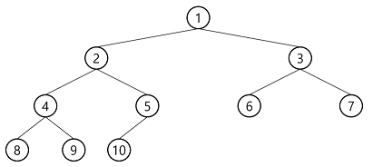
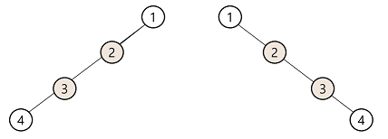

# Tree

명칭|name|설명
:-:|:-:|:-:
노드|node|트리의 원소
간선|edge|노드를 연결하는 선
루트 노드|root node|트리의 시작 노드
형제 노드|sibling node|같은 부모 노드의 자식 노드
조상 노드||부모노드부터 루트노드까지<br>경로의 모든 노드들
서브 트리|subtree|부모노드와 연결이 끊어져 생긴 트리
자손 노드||서브 트리에 있는 하위 레벨 노드들
단말 노드|leaf|차수가 0인 노드. 자식이 없는 노드

- 차수  
노드의 차수 : 노드에 연결 된 자식 노드의 수.  
트리의 차수 : 트리에 있는 노드의 차수 중에서 가장 큰 값.  

### 이진트리
> 모든 노드들이 2개의 서브트리를 갖는 특별한 형태의 트리.  
 - 최대 자식 노드 수 = 2  
 - 레벨 i에서의 최대 노드 수 = 2^i개
 - 높이가 h인 트리의 최소 노드 수 = h + 1개
 - 높이가 h인 트리의 최대 노드 수 = 2^(h+1) - 1개

### 포화 이진 트리(Full Binary Tree)
 - 모든 레벨의 노드가 포화 상태로 차 있는 이진 트리
 - 높이가 h일 때 노드 수가 2^(h+1) - 1개인 트리  


### 완전 이진 트리(Complaete Binary Tree)
 - 포화 이진 트리 중, 1~n번까지 노드 중 빈 자리가 없는 이진 트리
 - 높이가 h, 노드 수가 n 일 때 (단, h^2 + 1 <= n <= s^(h+1) - 1)  


### 편향 이진 트리(Skewed Binary Tree)
 - 높이가 h일 때 노드 수가 h + 1개인 이진 트리
 - 왼쪽 편향 이진 트리
 - 오른쪽 편향 이진 트리  


## 순회
포화 이진 트리의 순회 방식  
왼쪽 : index * 2  
오른쪽 : index * 2 + 1

전체 데이터의 중앙 값을 root node로 하여  
큰 값은 오른쪽, 작은 값은 왼쪽으로 두면  
이진 트리가 만들어진다.  
이 트리는 순회가 굉장히 빠르다.  
근데 그 이후에 계속 추가하면 트리 밸런스가 한쪽으로 몰린다.  
이때는 다시 트리를 재구성 한다.  

## 순회 방식
**pre order**
```java
public static void preOrder(int index) {
    if(index <= N && arrTree[index] != null) {
        System.out.print(arrTree[index] + " ");
        preOrder(index * 2);
        preOrder(index * 2 + 1);
    }
}
```
**in order**
```java
public static void inOrder(int index) {
    if(index <= N && arrTree[index] != null) {
        inOrder(index * 2);
        System.out.print(arrTree[index] + " ");
        inOrder(index * 2 + 1);
    }
}
```
**post order**
```java
public static void postOrder(int index) {
    if(index <= N && arrTree[index] != null) {
        postOrder(index * 2);
        postOrder(index * 2 + 1);
        System.out.print(arrTree[index] + " ");
    }
}
```
**정렬 된 데이터를 tree 배열로 만드는 방법**
```java
public static void insert(int index, int start, int end) {
    if(index <= N) {
        int middle = (start + end) >> 1;
        arrTree[index] = temp[middle];
        insert(index * 2, start, middle);
        insert(index * 2 + 1, middle + 1, end);
    }
}
```


