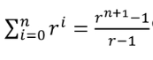

# Computatianal Thinking

p 이면 q 이다.  
에서 p가 거짓이면, 전체 명제는 참이 된다.  
p를 알기 힘들면 **대우**  
~q이면 ~p이다.  
를 증명하면 된다.

p|q|~p|(p->q)|(q->~p)|p^(q->~p)
:-:|:-:|:-:|:-:|:-:|:-:
T|T|F|T|F|F
T|F|F|F|T|T
F|T|T|T|T|F
F|F|T|T|T|F

## 당구공 문제

> ~~처음 뺀 당구공과 두번째 당구공의 색이 같음~~  

이 부분이 이상하다.  
제대로 된 증명은  
> p(1) - 당구공 하나를 상자에 넣는다.  
p(n) - 같은 색의 당구공 하나를 상자에 넣는다.

뭐... 이런식...

## 두 명제가 동등한가?
1. p^(pvq) 와 p  
2. ~pv~q 와 ~(pvq)

p|q|~p|~q|(pvq)|p^(pvq)|~pv~q
:-:|:-:|:-:|:-:|:-:|:-:|:-:
T|T|F|F|T|T|F
T|F|F|T|T|T|F
F|T|T|F|T|F|F
F|F|T|T|F|F|T

1번은 맞음  
2번은 맞음

- p^(pvq) 인수분해  
1. (p^~q)v(p^q)
2. p^(~qvq)
3. p^U = p

## n이 짝수이면 3n+5는 홀수임을 증명하라.
3*(2k)+5  
= 6k+4+1  
= 2(3k+2)+1  
마지막에 +1로 인해 홀수가 나온다.

## n이 홀수이면 n^2+n은 짝수임을 증명하라.
1. n이 홀수 일 때, n+1은 짝수이다.  
2. (n+1)*(n+1) = n^2+2n+1
3. n+1은 짝수 이므로, 위 식이 짝수가 되기 위해선
4. n^2+n이 짝수여야 한다.

자명한 걸 쓴다면... 

1. 홀수의 제곱은 홀수이다.
2. 홀수 더하기 홀수는 짝수이다.

이걸로 끝난다!!!

## n^2+5가 홀수이면 n은 짝수이다.(n은 자연수)
> 대우 이용!!  
n이 홀수이면 n^2+5는 짝수!

1. n -> 2k+1
2. (2k+1)*(2k+1)+5
3. = 4k^2+4k+6
4. = 2(2k^2+2k+3)

***
자연수 n에 대하여 짝수, 홀수를 묻는 명제!  
n이 **짝수** 일 때는, **2k**  
n이 **홀수** 일 때는, **2k+1**  
로 바꿔서 풀어보자!
***

## n^2이 3의 배수이면, n은 3의 배수임을 증명하라.
> 대우, n이 3의 배수가 아니라면, n^2이 3의 배수가 아니다.  
3의 배수는 3K이다.  
3k+1, 3k+2는 3의 배수가 아니다!

1. (3k+1)*(3k+1)
2. = 9k^2+6k+1
3. = 3(3k^2+2k)+1
4. (3k+2)*(3k+2)
5. = 9k^2+12k+4
6. = 3(3k^2+4k+1)+1

## n이 홀수이면, n^2을 8로 나눈 나머지는 1임을 증명하라.

> n을 4로 나눈 나머지가 1 혹은 3인 경우로 나누자!  
4k+1의 제곱! **8(2k^2+k)+1**  
4k+3의 제곱! **8(2k^2+4k+1)+1**

# 귀류법
모순을 이끌어내어 증명하는 방법!

## 루트2는 무리수임을 증명하라.
> 유리수라고 가정하고, 유리수가 되면 모순임을 증명하자!  
유리수는 기약분수로 가능.(서로소인 두 수의 분수형태)

1. 서로소 a, b가 있을 때, 루트2 = a/b로 루트2는 유리수라고 가정한다.
2. 2 = a^2/b^2
3. 2*b^2 = a^2
4. 이때 a^2짝수이면, a는 짝수이다.
5. 2*b^2 = 4k^2 으로 표현된다.
6. b^2 = 2k^2 이므로 b도 짝수이다.
7. a, b 모두 짝수이면, 서로소라는 가정이 모순된다.

## 1+2+...+n = n(n+1)/2임을 증명하라. (시그마k 증명)

1. p(1) = 1 이고,
2. p(n) = n(n+1)/2 이다.
3. p(n+1) = n(n+1)/2 + n+1  
4. = (n^2+n)/2 + (2n+2)/2  
5. = (n^2+3n+2)/2
6. = (n+1)(n+2)/2
7. 고로 p(n+1) = (n+1)(n+2)/2 이다.

##  증명

1. p(1) = ((r^1+1)-1)/(r-1) = r+1
2. p(n) = ((r^n+1)-1)/(r-1)
3. p(n+1) = ((r^n+1)-1)/(r-1) + r^n+1
4. = ((r^n+1)-1)/(r-1) + ((r^n+2)-(r^n+1))/(r-1)
5. = ((r^n+2)-1)/(r-1)
6. 고로 p(n+1) = ((r^n+2)-1)/(r-1)

## 2이상의 모든 자연수 n에 대해 n^3-n은 6으로 나누어 떨어짐을 증명하라.
> 정수론에 의해서 연속된 3수의 곱은 6으로 나누어 떨어진다.  
n*(n+1)*(n+2)은 6의 배수이다. 
> 1. 위 식을 n*(n-1)*(n+1)로 쓸 수도 있다.
> 2. (n^2-n)*(n+1)
> 3. = n^3+n^2-n^2-n
> 4. = n^3-n  

이걸 증명 해보자! 귀납법으로...

1. p(1) = 0
2. p(n) = n^3-n이 6으로 나누어 진다.
3. p(n+1) = (n+1)^3-(n+1)
4. = n^3+3n^2+2n
5. = n(n+1)(n+2) 이고,
6. p(n+1) = n*(n+1)*(n+2) 는 6으로 나누어진다.

## Tip...
- 짝수 2n(간혹 4n, 4n+2)  
- 홀수 2n+1(간혹 4n+1, 4n+3)  
- 정사각형 마방진= 짝수 마방진+ 홀수 마방진= 짝수(4n 마방지 + 4n+2 마방진) + 2n+1홀수 마방진  
- n(n+1)(n+2) 또는 (n-1)n(n+1), 연속인 세 숫자는 6의 배수이다.
- [n] 사우느 n을 넘지 않는 최대 정수
- 9%2 = 9-[9/2]*2 = 1
- [log(10)n]자릿수 구할 때, 예) [log(10)123] = 2
- [9/2] => 9/2 프로그래밍 정수 연산.

## 페르마의 소정리
2^1 % 5 = 2  
2^2 % 5 = 4  
2^3 % 5 = 3  
2^4 % 5 = 1  
2^5 = 2^4*2^1 % 5 = 2

어떤 숫자 a의 p승에 대하여 p로 모듈레이션 하면 a가 나온다.  
(단, a!=p, a는 정수, p가 소수이다)  
> a^p % p = a  
(a^p-1) % p = 1  
a^p-2 % p = 1/a  

5C3 = 10  
5C3 % 7 = 3  
10 % 7 = 3  

이게 과연 페르마의 소정리로 되는가?

1/6 = 6^(7-2)  
1/2 = 2^(7-2)

5!/3!2! = 5! * 6^5 * 2^5 (mod 7)  
= 120 * 6((6^2)^2) * 2((2^2)^2)  
[모듈레이션 7]  
= 1 * 6(1^2) * 4^2  
= 96 % 7 = 3

## nCr (조합)
1) 0!=1
2) 1!=1
3) nC0 = nCn = 1
4) nCr = nC(n-r)
5) nCr = n!/(n-r)!r!
6) Pascal의 삼각형  
nCr = (n-1)C(r-1)+(n-1)Cr
7) (n-1)C(r-1) = (n-1)!/(n-r)!(r-1)!  
= (n-1)!/(n-r)!(r-1)! * rn/rn  
= n!/(n-r)!r! * r/n  
= nCr * r/n  
=> nCr = n/r * (n-1)C(r-1)
8) (n-1)Cr = (n-1)! /(n-1-r)!r!  
분자, 분모에 n(n-r)/n(n-r)을 곱한다.  
= n!(n-r)/(n-r)!r!n  
= (n-r)/n * nCr  
=> nCr = n/(n-r) * (n-1)Cr
9) nC(r-1) = nCr * r/(n-r+1)
10) nPr = n!/(n-r)!  
= n!r!/(n-r)!r!  
= nCr * r!  
-> nCr = 1/r! * nPr

